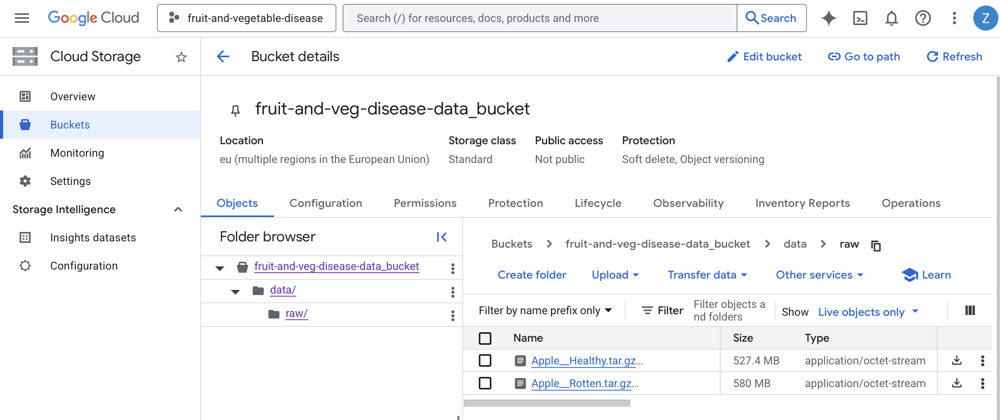
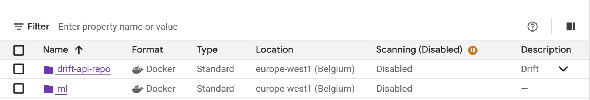
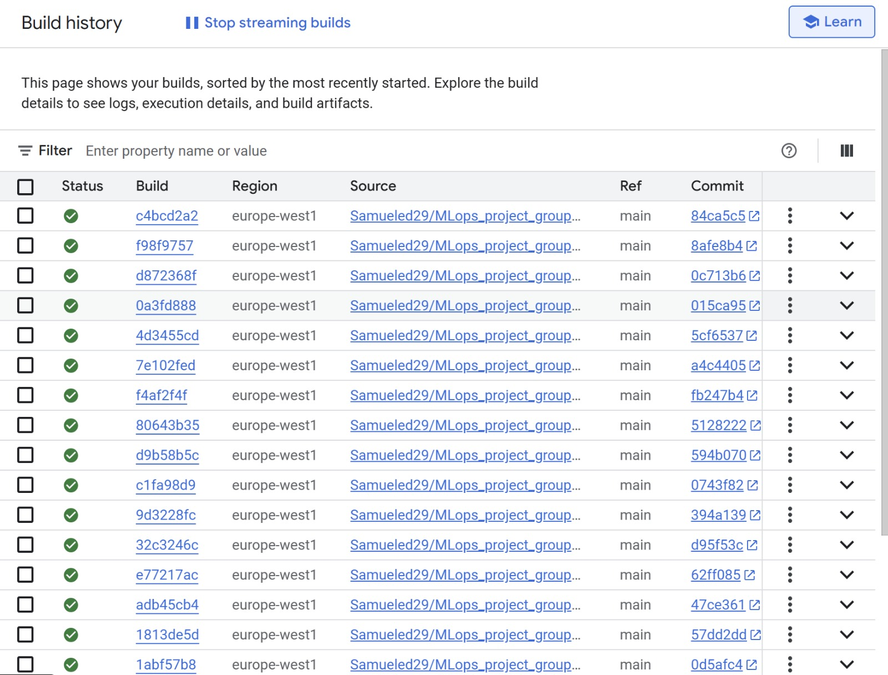

# Exam template for 02476 Machine Learning Operations

This is the report template for the exam. Please only remove the text formatted as with three dashes in front and behind
like:

```--- question 1 fill here ---```

Where you instead should add your answers. Any other changes may have unwanted consequences when your report is
auto-generated at the end of the course. For questions where you are asked to include images, start by adding the image
to the `figures` subfolder (please only use `.png`, `.jpg` or `.jpeg`) and then add the following code in your answer:

``

In addition to this markdown file, we also provide the `report.py` script that provides two utility functions:

Running:

```bash
python report.py html
```

Will generate a `.html` page of your report. After the deadline for answering this template, we will auto-scrape
everything in this `reports` folder and then use this utility to generate a `.html` page that will be your serve
as your final hand-in.

Running

```bash
python report.py check
```

Will check your answers in this template against the constraints listed for each question e.g. is your answer too
short, too long, or have you included an image when asked. For both functions to work you mustn't rename anything.
The script has two dependencies that can be installed with

```bash
pip install typer markdown
```

or

```bash
uv add typer markdown
```

## Overall project checklist

The checklist is *exhaustive* which means that it includes everything that you could do on the project included in the
curriculum in this course. Therefore, we do not expect at all that you have checked all boxes at the end of the project.
The parenthesis at the end indicates what module the bullet point is related to. Please be honest in your answers, we
will check the repositories and the code to verify your answers.

### Week 1

* [x] Create a git repository (M5)
* [x] Make sure that all team members have write access to the GitHub repository (M5)
* [x] Create a dedicated environment for you project to keep track of your packages (M2)
* [x] Create the initial file structure using cookiecutter with an appropriate template (M6)
* [x] Fill out the `data.py` file such that it downloads whatever data you need and preprocesses it (if necessary) (M6)
* [x] Add a model to `model.py` and a training procedure to `train.py` and get that running (M6)
* [x] Remember to either fill out the `requirements.txt`/`requirements_dev.txt` files or keeping your
    `pyproject.toml`/`uv.lock` up-to-date with whatever dependencies that you are using (M2+M6)
* [x] Remember to comply with good coding practices (`pep8`) while doing the project (M7)
* [ ] Do a bit of code typing and remember to document essential parts of your code (M7)
* [ ] Setup version control for your data or part of your data (M8)
* [ ] Add command line interfaces and project commands to your code where it makes sense (M9)
* [x] Construct one or multiple docker files for your code (M10)
* [x] Build the docker files locally and make sure they work as intended (M10)
* [x] Write one or multiple configurations files for your experiments (M11)
* [x] Used Hydra to load the configurations and manage your hyperparameters (M11)
* [x] Use profiling to optimize your code (M12)
* [x] Use logging to log important events in your code (M14)
* [x] Use Weights & Biases to log training progress and other important metrics/artifacts in your code (M14)
* [x] Consider running a hyperparameter optimization sweep (M14)
* [ ] Use PyTorch-lightning (if applicable) to reduce the amount of boilerplate in your code (M15)

### Week 2

* [x] Write unit tests related to the data part of your code (M16)
* [x] Write unit tests related to model construction and or model training (M16)
* [x] Calculate the code coverage (M16)
* [x] Get some continuous integration running on the GitHub repository (M17)
* [x] Add caching and multi-os/python/pytorch testing to your continuous integration (M17)
* [x] Add a linting step to your continuous integration (M17)
* [x] Add pre-commit hooks to your version control setup (M18)
* [ ] Add a continues workflow that triggers when data changes (M19)
* [ ] Add a continues workflow that triggers when changes to the model registry is made (M19)
* [x] Create a data storage in GCP Bucket for your data and link this with your data version control setup (M21)
* [x] Create a trigger workflow for automatically building your docker images (M21)
* [x] Get your model training in GCP using either the Engine or Vertex AI (M21)
* [x] Create a FastAPI application that can do inference using your model (M22)
* [ ] Deploy your model in GCP using either Functions or Run as the backend (M23)
* [x] Write API tests for your application and setup continues integration for these (M24)
* [x] Load test your application (M24)
* [ ] Create a more specialized ML-deployment API using either ONNX or BentoML, or both (M25)
* [x] Create a frontend for your API (M26)

### Week 3

* [x] Check how robust your model is towards data drifting (M27)
* [x] Setup collection of input-output data from your deployed application (M27)
* [x] Deploy to the cloud a drift detection API (M27)
* [ ] Instrument your API with a couple of system metrics (M28)
* [ ] Setup cloud monitoring of your instrumented application (M28)
* [ ] Create one or more alert systems in GCP to alert you if your app is not behaving correctly (M28)
* [ ] If applicable, optimize the performance of your data loading using distributed data loading (M29)
* [ ] If applicable, optimize the performance of your training pipeline by using distributed training (M30)
* [ ] Play around with quantization, compilation and pruning for you trained models to increase inference speed (M31)

### Extra

* [ ] Write some documentation for your application (M32)
* [ ] Publish the documentation to GitHub Pages (M32)
* [ ] Revisit your initial project description. Did the project turn out as you wanted?
* [ ] Create an architectural diagram over your MLOps pipeline
* [ ] Make sure all group members have an understanding about all parts of the project
* [ ] Uploaded all your code to GitHub

## Group information

### Question 1
> **Enter the group number you signed up on <learn.inside.dtu.dk>**
>
> Answer:

71

### Question 2
> **Enter the study number for each member in the group**
>
> Example:
>
> *sXXXXXX, sXXXXXX, sXXXXXX*
>
> Answer:

s242916, s253125, s253762, s243599, s253136

### Question 3
> **Did you end up using any open-source frameworks/packages not covered in the course during your project? If so**
> **which did you use and how did they help you complete the project?**
>
> Recommended answer length: 0-200 words.
>
> Example:
> *We used the third-party framework ... in our project. We used functionality ... and functionality ... from the*
> *package to do ... and ... in our project*.
>
> Answer:

In the model, we used a ViT transformer from Transformers - hugging face open-source library. It allowed us to focus more on the machine learning operations, rather than working on creating our own model code. This solution is also well-suited for the goal of our project, which is a binary classification of apples based on their images.

## Coding environment

> In the following section we are interested in learning more about you local development environment. This includes
> how you managed dependencies, the structure of your code and how you managed code quality.

### Question 4

> **Explain how you managed dependencies in your project? Explain the process a new team member would have to go**
> **through to get an exact copy of your environment.**
>
> Recommended answer length: 100-200 words
>
> Example:
> *We used ... for managing our dependencies. The list of dependencies was auto-generated using ... . To get a*
> *complete copy of our development environment, one would have to run the following commands*
>
> Answer:

We used uv for managing our dependencies and a cookiecutter template for the project structure, that comes with a few initial dependencies. The dependencies and general project requirements are defined in the file pyproject.toml and the file uv.lock stores the exact versions of the dependencies to reproduce exactly the same environment. Throughout the development process the dependencies were added using uv add command. To get a complete copy of our development environment, one would have to run the following commands: git clone 'github-url' and uv sync inside the project root, assuming that git and uv are already installed on the machine.

### Question 5

> **We expect that you initialized your project using the cookiecutter template. Explain the overall structure of your**
> **code. What did you fill out? Did you deviate from the template in some way?**
>
> Recommended answer length: 100-200 words
>
> Example:
> *From the cookiecutter template we have filled out the ... , ... and ... folder. We have removed the ... folder*
> *because we did not use any ... in our project. We have added an ... folder that contains ... for running our*
> *experiments.*
>
> Answer:

From the cookiecutter template we have filled out the configs folder with .yaml configuration files for training the model with two sets of hyperparameters and for using two versions of the ViT model, the src folder for the the source code - we implemented all the files apart from visualize.py and the tests folder where we implemented api testing and unit tests for the source code. In our source code we create a structure of data directories for storing the raw and the preprocessed files. Also the files pyproject.toml and uv.lock were continously updated.

### Question 6

> **Did you implement any rules for code quality and format? What about typing and documentation? Additionally,**
> **explain with your own words why these concepts matters in larger projects.**
>
> Recommended answer length: 100-200 words.
>
> Example:
> *We used ... for linting and ... for formatting. We also used ... for typing and ... for documentation. These*
> *concepts are important in larger projects because ... . For example, typing ...*
>
> Answer:

To ensure consistent code quality, we use automated tools for linting, formatting, and static analysis. Specifically, we rely on Ruff, configured via pyproject.toml, to enforce a standardized code style and catch common issues early. These checks run automatically through pre-commit hooks, preventing non-compliant code from being committed. Additionally, a GitHub Actions workflow runs on every push and pull request to verify that the code passes formatting and test requirements, ensuring continuous compliance.

These practices are especially important in larger projects where multiple developers collaborate. Standardized formatting, typing, and quality rules help bridge different coding habits, reduce mistakes caused by inconsistencies, and make it easier to identify syntax or logic bugs. They also improve the overall readability of the codebase, making it easier to understand code written by others or by yourself after some time.

## Version control

> In the following section we are interested in how version control was used in your project during development to
> corporate and increase the quality of your code.

### Question 7

> **How many tests did you implement and what are they testing in your code?**
>
> Recommended answer length: 50-100 words.
>
> Example:
> *In total we have implemented X tests. Primarily we are testing ... and ... as these the most critical parts of our*
> *application but also ... .*
>
> Answer:

We have implemented 49 tests that test the source code located in the src folder. The file test_data.py checks if the the download of the files works correctly and if the proper directories are created. It also checks if the images and labels have correct properties, and if data splitting and normalizing create a desired output. The test_model.py checks if the model output has correct type and shape and the test_train.py checks the properties of input and output of the training process as well as the resizing of the images and the accuracy calculation.

### Question 8

> **What is the total code coverage (in percentage) of your code? If your code had a code coverage of 100% (or close**
> **to), would you still trust it to be error free? Explain you reasoning.**
>
> Recommended answer length: 100-200 words.
>
> Example:
> *The total code coverage of code is X%, which includes all our source code. We are far from 100% coverage of our **
> *code and even if we were then...*
>
> Answer:

The total coverage of our code is 39%, which does not cover all our source code (no tests for evaluate.py). We are far from 100% coverage of our code and even if we were then it does not mean the code is bug free. Some not obvious test cases could be missed and lead to errors.

### Question 9

> **Did you workflow include using branches and pull requests? If yes, explain how. If not, explain how branches and**
> **pull request can help improve version control.**
>
> Recommended answer length: 100-200 words.
>
> Example:
> *We made use of both branches and PRs in our project. In our group, each member had an branch that they worked on in*
> *addition to the main branch. To merge code we ...*
>
> Answer:

We made use of both branches and pull requests in our project. Each seperate functionality had its own branch, as we believe this practice gives more flexbility than having one multi-purpose branch per every developer. To merge the code we opened pull requests, however usually we did not assign any approver and so we were closing the pull requests by ourselves. In this way, we were not really harnessing the advantages of using pull requests, which we are now aware of.

### Question 10

> **Did you use DVC for managing data in your project? If yes, then how did it improve your project to have version**
> **control of your data. If no, explain a case where it would be beneficial to have version control of your data.**
>
> Recommended answer length: 100-200 words.
>
> Example:
> *We did make use of DVC in the following way: ... . In the end it helped us in ... for controlling ... part of our*
> *pipeline*
>
> Answer:

Although we have implemented the DVC configuration, we had only one version of data throughout the whole development process, what did not allow us to use the proper functionality of the DVC setup. However, if the data files were preprocessed in multiple different ways or feature engineering was being performed in between training experiments, then DVC would become highly useful to keep track of the changes and make it easy to go back to the older versions.

### Question 11

> **Discuss you continuous integration setup. What kind of continuous integration are you running (unittesting,**
> **linting, etc.)? Do you test multiple operating systems, Python  version etc. Do you make use of caching? Feel free**
> **to insert a link to one of your GitHub actions workflow.**
>
> Recommended answer length: 200-300 words.
>
> Example:
> *We have organized our continuous integration into 3 separate files: one for doing ..., one for running ... testing*
> *and one for running ... . In particular for our ..., we used ... .An example of a triggered workflow can be seen*
> *here: <weblink>*
>
> Answer:

Our CI is implemented with three separate **GitHub Actions** workflows under `.github/workflows`:
- **Linting workflow**
- **Unit testing workflow**
- **Pre-commit autoupdate workflow**

### Triggers
- Linting and testing run automatically on **every push** and when changes are merged into **`main`**.
- Pre-commit autoupdate runs on a **scheduled overnight cadence** to keep hooks/tools up to date.

### Testing (portability & compatibility)
- Unit tests run with **pytest** (with coverage reporting) across a matrix of:
  - OS: **Ubuntu, Windows, macOS**
  - Python: **3.12, 3.13**
  - PyTorch: **2.5.1, 2.6.0**
- This matrix surfaced **four failing cases on PyTorch 2.5.1**, demonstrating the value of CI for catching environment-specific issues early.

### Dependency installation & caching
Both linting and testing use `astral-sh/setup-uv@v7` with caching enabled:
```yaml
- uses: astral-sh/setup-uv@v7
  with:
    enable-cache: true
````

### Linting checks (Ruff)

In the linting workflow we enforce both static analysis and formatting checks:

```yaml
- name: Ruff check
  run: uv run ruff check . --output-format=github

- name: Ruff format (check)
  run: uv run ruff format --check .
```

### Pre-commit autoupdate (scheduled)

The pre-commit update workflow is granted write permissions to open automated pull requests:

```yaml
permissions:
  contents: write
  pull-requests: write
```

It periodically updates hooks with:

```yaml
- name: Pre-commit autoupdate
  run: uv run pre-commit autoupdate
```

### Reference

* [GitHub Actions workflows](https://github.com/Samueled29/MLops_project_group71/tree/main/.github/workflows)


## Running code and tracking experiments

> In the following section we are interested in learning more about the experimental setup for running your code and
> especially the reproducibility of your experiments.

### Question 12

> **How did you configure experiments? Did you make use of config files? Explain with coding examples of how you would**
> **run a experiment.**
>
> Recommended answer length: 50-100 words.
>
> Example:
> *We used a simple argparser, that worked in the following way: Python  my_script.py --lr 1e-3 --batch_size 25*
>
> Answer:


Experiments are managed with **Hydra** using a modular set of YAML configuration files stored in `configs/`.

- The main entrypoint (`train.py`) is annotated with `@hydra.main` and loads `config.yaml` as the root configuration.
- `config.yaml` composes sub-configurations for:
  - **dataset** selection
  - **experiment** settings (e.g., batch size, epochs)
  - **model** architecture
  - **optimizer**

### Example: override configs from the CLI
Hydra allows changing experiments without editing code by overriding parameters at runtime:
```bash
python train.py experiments=exp_fast model=vit_tiny optimizer=adam
```

### Question 13

> **Reproducibility of experiments are important. Related to the last question, how did you secure that no information**
> **is lost when running experiments and that your experiments are reproducible?**
>
> Recommended answer length: 100-200 words.
>
> Example:
> *We made use of config files. Whenever an experiment is run the following happens: ... . To reproduce an experiment*
> *one would have to do ...*
>
> Answer:

Reproducibility is ensured through **Hydra-based experiment management** and automatic configuration tracking.

- Each run is defined by a composition of modular YAML configs specifying the **dataset**, **model architecture**, **optimizer**, and **training hyperparameters**.
- On execution, Hydra creates a dedicated output folder (e.g., `outputs/apple/<timestamp>/`) containing a `.hydra/` directory.

### What Hydra saves per run
Inside `.hydra/`, Hydra stores:
- `config.yaml`: the fully resolved configuration used for the run
- `overrides.yaml`: all command-line overrides applied (e.g., `experiments=exp_fast`)
- `hydra.yaml`: Hydra runtime settings

This guarantees that the exact configuration (defaults + overrides) is preserved alongside outputs/logs, enabling experiments to be reproduced by rerunning training with the same stored settings.

### Controlling randomness
A **fixed random seed** is defined in the configuration and applied at runtime to reduce stochastic variation across runs.


### Question 14

> **Upload 1 to 3 screenshots that show the experiments that you have done in W&B (or another experiment tracking**
> **service of your choice). This may include loss graphs, logged images, hyperparameter sweeps etc. You can take**
> **inspiration from [this figure](figures/wandb.png). Explain what metrics you are tracking and why they are**
> **important.**
>
> Recommended answer length: 200-300 words + 1 to 3 screenshots.
>
> Example:
> *As seen in the first image when have tracked ... and ... which both inform us about ... in our experiments.*
> *As seen in the second image we are also tracking ... and ...*
>
> Answer:

--- question 14 fill here ---

### Question 15

> **Docker is an important tool for creating containerized applications. Explain how you used docker in your**
> **experiments/project? Include how you would run your docker images and include a link to one of your docker files.**
>
> Recommended answer length: 100-200 words.
>
> Example:
> *For our project we developed several images: one for training, inference and deployment. For example to run the*
> *training docker image: `docker run trainer:latest lr=1e-3 batch_size=64`. Link to docker file: <weblink>*
>
> Answer:

For the project, we used different docker images. one for training, for which we set up a trigger with GCP, so that every time a push happens on the main branch of the repository, a docker image is built on the cloud (then we only saved the latest ones). Another image is for the api to run them. Finally, another image has been created when deploying the api to check drift in the data during the monitorin part, so it has been uploaded to GCP as well.

### Question 16

> **When running into bugs while trying to run your experiments, how did you perform debugging? Additionally, did you**
> **try to profile your code or do you think it is already perfect?**
>
> Recommended answer length: 100-200 words.
>
> Example:
> *Debugging method was dependent on group member. Some just used ... and others used ... . We did a single profiling*
> *run of our main code at some point that showed ...*
>
> Answer:

Most bugs surfaced during experiments, so we used fast, reproducible loops: `uv run pytest` for unit tests, `uv run pytest tests/test_train.py -k small` to isolate failing cases, and reran `uv run python src/fruit_and_vegetable_disease/train.py` with verbose logging to inspect **Hydra** configs and warnings.

We did not assume the code was perfect: we enabled the built-in **PyTorch profiler** for the first five batches, saved traces to `logs/profiler`, and viewed them in **TensorBoard**. The traces showed no dominant CPU or CUDA hotspot, so we keep profiling off by default to speed up iterations.


## Working in the cloud

> In the following section we would like to know more about your experience when developing in the cloud.

### Question 17

> **List all the GCP services that you made use of in your project and shortly explain what each service does?**
>
> Recommended answer length: 50-200 words.
>
> Example:
> *We used the following two services: Engine and Bucket. Engine is used for... and Bucket is used for...*
>
> Answer:

We used the following services: Storage to create a bucket for storing the data using dvc, Build to create docker images of the current state of the main branch of the project's repository, Engine and Vertex AI for running the experiments and Artifact Registry for storing the docker images with the training experiments.

### Question 18

> **The backbone of GCP is the Compute engine. Explained how you made use of this service and what type of VMs**
> **you used?**
>
> Recommended answer length: 100-200 words.
>
> Example:
> *We used the compute engine to run our ... . We used instances with the following hardware: ... and we started the*
> *using a custom container: ...*
>
> Answer:

--- question 18 fill here ---

### Question 19

> **Insert 1-2 images of your GCP bucket, such that we can see what data you have stored in it.**
> **You can take inspiration from [this figure](figures/bucket.png).**
>
> Answer:



### Question 20

> **Upload 1-2 images of your GCP artifact registry, such that we can see the different docker images that you have**
> **stored. You can take inspiration from [this figure](figures/registry.png).**
>
> Answer:



### Question 21

> **Upload 1-2 images of your GCP cloud build history, so we can see the history of the images that have been build in**
> **your project. You can take inspiration from [this figure](figures/build.png).**
>
> Answer:



### Question 22

> **Did you manage to train your model in the cloud using either the Engine or Vertex AI? If yes, explain how you did**
> **it. If not, describe why.**
>
> Recommended answer length: 100-200 words.
>
> Example:
> *We managed to train our model in the cloud using the Engine. We did this by ... . The reason we choose the Engine*
> *was because ...*
>
> Answer:

--- question 22 fill here ---

## Deployment

### Question 23

> **Did you manage to write an API for your model? If yes, explain how you did it and if you did anything special. If**
> **not, explain how you would do it.**
>
> Recommended answer length: 100-200 words.
>
> Example:
> *We did manage to write an API for our model. We used FastAPI to do this. We did this by ... . We also added ...*
> *to the API to make it more ...*
>
> Answer:

We implemented a **FastAPI** service to expose the trained model for inference.

- The model is loaded **once at startup** using the FastAPI lifespan hook, with configurable `MODEL_PATH` and `DEVICE`, so weights are not reloaded on every request.
- The main endpoint, `POST /predict`, accepts an uploaded image and applies the **same preprocessing as training** (resize, normalization, channel expansion) to ensure consistency between training and inference.
- Inference runs under `torch.inference_mode()` and returns a JSON response containing:
  - the predicted label (`healthy` or `rotten`)
  - a confidence score (softmax probability)

### Safety and monitoring
- Basic validation is included (content-type, max upload size, corrupted images).
- The API exposes `GET /health` and `GET /ready` for monitoring and readiness checks.

### Question 24

> **Did you manage to deploy your API, either in locally or cloud? If not, describe why. If yes, describe how and**
> **preferably how you invoke your deployed service?**
>
> Recommended answer length: 100-200 words.
>
> Example:
> *For deployment we wrapped our model into application using ... . We first tried locally serving the model, which*
> *worked. Afterwards we deployed it in the cloud, using ... . To invoke the service an user would call*
> *`curl -X POST -F "file=@file.json"<weburl>`*
>
> Answer:

We deployed our API locally, using FastAPI, adding endpoints so that it is possible to make predictions from the model using this API, just by uploading a picture. Furthermore, we added a small frontend (local). For what concerns cloud deployment, we did for the API concerning monitoring (data drifting), whereas the API to make predictions has been only deployed locally.
to invoke the predict it can be used: 
curl -X POST http://localhost:8000/predict \
  -H "Content-Type: multipart/form-data" \
  -F "file=@/path/to/image.png;type=image/png"
for predict_log:
curl -X POST https://drift-api-562538755536.europe-west1.run.app/predict_log \
  -H "Content-Type: application/json" \
  -d '{
        "image_tensor": [0.0, 0.1, ...],
        "prediction": 1,
        "timestamp": "2026-01-23T12:00:00Z"
      }'
  for drift_check:
  curl -X POST "https://drift-api-562538755536.europe-west1.run.app/drift_check?n_predictions=100"

### Question 25

> **Did you perform any unit testing and load testing of your API? If yes, explain how you did it and what results for**
> **the load testing did you get. If not, explain how you would do it.**
>
> Recommended answer length: 100-200 words.
>
> Example:
> *For unit testing we used ... and for load testing we used ... . The results of the load testing showed that ...*
> *before the service crashed.*
>
> Answer:

We implemented unit testing using pytest together with **FastAPI’s TestClient** to validate all API endpoints. The test suite (`tests/test_api.py`) contains six unit tests that cover the health and readiness endpoints, the prediction endpoint with valid image inputs, correct error handling for invalid content types (returning `HTTP 400`), proper behavior when the model is unavailable (returning `HTTP 503`), and validation of prediction outputs such as confidence values remaining within 0–1 and labels belonging to the expected set.
All tests pass and can be executed via `uv run pytest tests/test_api.py`.

For load testing, we used **Locust** to emulate realistic traffic patterns with weighted tasks for health checks, readiness checks, and image predictions. Under 50 concurrent users over 60 seconds, the API served 1,385 requests with zero failures, achieving 23.2 requests/second and maintaining low median latencies, including sub-25 ms for predictions.

### Question 26

> **Did you manage to implement monitoring of your deployed model? If yes, explain how it works. If not, explain how**
> **monitoring would help the longevity of your application.**
>
> Recommended answer length: 100-200 words.
>
> Example:
> *We did not manage to implement monitoring. We would like to have monitoring implemented such that over time we could*
> *measure ... and ... that would inform us about this ... behaviour of our application.*
>
> Answer:

We implemented monitoring. First, since our model works with classification of images, we tried to implement an artificial drift of the images,using create_drifted_dataset.py (adding blur and other modifications) so that we would have a drifted dataset, then we run the script check_data_drift.py we generate an html report to see if the dataset has actually drifted, and we do a test with the script check_data_quality.py. After this was done, we tested our model on the original and drifted dataset, and we saw that the model performance were somewhat similar, so that the model was robust to this kind of drift. However, drift in dataset balance has not been tested. Then we wrote an API to log new data and to run a drift test on this new dataset saved on gcp bucket.

## Overall discussion of project

> In the following section we would like you to think about the general structure of your project.

### Question 27

> **How many credits did you end up using during the project and what service was most expensive? In general what do**
> **you think about working in the cloud?**
>
> Recommended answer length: 100-200 words.
>
> Example:
> *Group member 1 used ..., Group member 2 used ..., in total ... credits was spend during development. The service*
> *costing the most was ... due to ... . Working in the cloud was ...*
>
> Answer:

In total we spent 14$ of credits, as we only run trainings, or built images when we were quite sure with the our work, also the model is not huge so that did not cost too much.
In general, we tried to have a really parsimonious approach to the cloud as, especially at the beginning we were scared of running out of credit, so in the end we ended up much less than we thought.

### Question 28

> **Did you implement anything extra in your project that is not covered by other questions? Maybe you implemented**
> **a frontend for your API, use extra version control features, a drift detection service, a kubernetes cluster etc.**
> **If yes, explain what you did and why.**
>
> Recommended answer length: 0-200 words.
>
> Example:
> *We implemented a frontend for our API. We did this because we wanted to show the user ... . The frontend was*
> *implemented using ...*
>
> Answer:

We implemented a minimal **frontend** to provide an end-to-end demo for non-technical users.

- Built with plain **HTML/CSS/JavaScript** (no framework).
- Uploads an image and sends it to `POST /predict` using `fetch` + `FormData`.
- Displays the returned **predicted label** and **confidence score** in the page UI.


### Question 29

> **Include a figure that describes the overall architecture of your system and what services that you make use of.**
> **You can take inspiration from [this figure](figures/overview.png). Additionally, in your own words, explain the**
> **overall steps in figure.**
>
> Recommended answer length: 200-400 words
>
> Example:
>
> *The starting point of the diagram is our local setup, where we integrated ... and ... and ... into our code.*
> *Whenever we commit code and push to GitHub, it auto triggers ... and ... . From there the diagram shows ...*
>
> Answer:

--- question 29 fill here ---

### Question 30

> **Discuss the overall struggles of the project. Where did you spend most time and what did you do to overcome these**
> **challenges?**
>
> Recommended answer length: 200-400 words.
>
> Example:
> *The biggest challenges in the project was using ... tool to do ... . The reason for this was ...*
>
> Answer:

We had various struggles at different points of the project development. At first, when we approached the topic of training in the cloud, we wanted to use Vertex AI, however it seemed much more complex and after a few trials, we switched to Compute Engine for the rest of the project. Then, close to the end of the project development, we encountered a undesired behaviour of our model - the accuracy was 1.0 from the first epoch. The challenge was to locate the exact point when the model started to deviate due to many commits and pull requestes during the last few days of the project. The process of finding the problem in our code's logic took significantly more time than expected. We believe that the biggest challenge in the project, that also led to the previously described issue, was that we were updating the data.py and train.py continuously due to the new tools introduced in the course, and all of us had a different goal (to set up another feature or tool) when making the changes in these files.

### Question 31

> **State the individual contributions of each team member. This is required information from DTU, because we need to**
> **make sure all members contributed actively to the project. Additionally, state if/how you have used generative AI**
> **tools in your project.**
>
> Recommended answer length: 50-300 words.
>
> Example:
> *Student sXXXXXX was in charge of developing of setting up the initial cookie cutter project and developing of the*
> *docker containers for training our applications.*
> *Student sXXXXXX was in charge of training our models in the cloud and deploying them afterwards.*
> *All members contributed to code by...*
> *We have used ChatGPT to help debug our code. Additionally, we used GitHub Copilot to help write some of our code.*
> Answer:

--- question 31 fill here ---
